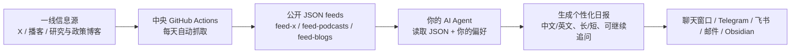

# 宏观信号 · Macro Signal

追踪全球宏观与中国经济的一线信号——独立分析师、央行研究、一手数据，不是二手转述。

这是一份给 AI Agent 用户的精心筛选信息源。中央每天自动抓取推文、播客和研究/政策博客；你的 Agent 读取 JSON，按你的口味生成日报。

**这份清单本身就是产品。**

> 本项目由 [ai-signal](https://github.com/Benboerba620/ai-signal)（AI 一线信号追踪）fork 而来，2026-07 起改造为宏观经济 / 中国经济 / 市场信号追踪系统。技术上仍沿用 `ai-signal` 的目录名和 `/ai-signal` 触发词，便于复用已有的定时任务和配置。

## 最近更新

- `2026-07-12`：完成宏观化改造——修复了一个会让宏观推文被误过滤的 bug（Twitter 过滤器此前默认用 AI 关键词白名单，非 AI 话题的推文只是"碰巧"命中才被放行）；移除 arXiv 论文板块（宏观研究基本不在 arXiv 上，价值有限）；全部信息源与摘要 prompt 改写为宏观/中国经济/市场框架，不再按 AI 相关性过滤内容。
- `2026-07-11`：X 推文管道跑通——修复 GitHub Actions 从未真正触发过的问题，`TWITTER_COOKIES` 配置正确后首次抓到真实推文。
- `2026-07-10`：信息源整体换血——推特账号换成 Brad Setser / Michael Pettis / Robin Brooks / Dan Wang 等宏观与中国经济分析师，播客换成 Odd Lots / Invest Like the Best / MacroVoices / Acquired，新增 14 个研究与政策博客（BIS、NY Fed、NBER、Sinocism、ChinaTalk 等）。

完整历史见 [CHANGELOG](CHANGELOG.md)。

---

## 你会得到什么

由你的 AI Agent 读取中央 JSON 后生成一份日报（可直接在聊天里看；如果你的 Agent 支持定时任务，也可以每天自动推送），包含：

- 精选宏观/中国经济分析师的当日观点（原文 + 翻译）
- 宏观与投资播客的最新内容（含全文字幕，不是摘要的摘要）
- 央行研究博客（BIS、NY Fed）、NBER 工作论文，以及独立中国观察者的最新分析
- 按你的偏好定制：中文 / 英文 / 双语，精华 / 标准 / 完整
- 不需要内容 API key——所有内容由中央服务统一抓取

> Macro Signal 是 **Agent-first** 架构：中央只供料，不替每个用户生成最终日报。真正的总结、翻译、格式定制，都由用户自己的 Agent 完成。

## 日报不是终点

日报只是第一层筛选。看完以后你可以继续让 Agent 展开任意一条内容，尤其是长播客或研究博客：

- "展开第 2 个播客"
- "把 Setser 那条推文的分歧点讲清楚"
- "这篇 NY Fed 的文章按论点、证据、政策含义展开"

如果该播客有全文字幕，Agent 会优先读取 transcript 文件，而不是只根据标题或简介发挥。

## 信息源

### Twitter/X（10 个账号）

**分析师/研究者**：[@Brad_Setser](https://x.com/Brad_Setser)（对外经济关系委员会，跨境资本流动）、[@michaelxpettis](https://x.com/michaelxpettis)（中国宏观、全球失衡）、[@RobinBrooksIIF](https://x.com/RobinBrooksIIF)（前 IIF 首席经济学家，汇率与资本流动）、[@DanWangTech](https://x.com/DanWangTech)（中国产业政策）、[@PaulTriolo](https://x.com/PaulTriolo)（中国科技政策与出口管制）、[@TomOrlik](https://x.com/TomOrlik)（彭博经济，中国数据）、[@YuanTalks](https://x.com/YuanTalks)（人民币与中国市场）

**知名投资人**：[@RayDalio](https://x.com/RayDalio)（桥水，长周期债务/货币框架）、[@CliffordAsness](https://x.com/CliffordAsness)（AQR，量化与市场结构）、[@BillAckman](https://x.com/BillAckman)（Pershing Square）

> 选人标准：有独立判断、用真金白银下注或长期跟踪一手数据，不选搬运号、评论员、流量账号。

### 播客（4 个频道）

| 频道 | 为什么选 |
|------|----------|
| [Odd Lots](https://www.bloomberg.com/oddlots) | 彭博出品，市场结构与宏观机制的深度对话 |
| [Invest Like the Best](https://www.joincolossus.com/episodes) | 顶级投资人的思维框架 |
| [MacroVoices](https://www.macrovoices.com) | 纯宏观交易者视角，利率/汇率/大宗商品 |
| [Acquired](https://www.acquired.fm) | 公司深度史，常牵出产业与市场结构的宏观线索 |

### 研究与政策博客（14 个源）

| 来源 | 类型 |
|------|------|
| [BIS Research Papers](https://www.bis.org) | 国际清算银行研究论文 |
| [NY Fed Liberty Street Economics](https://libertystreeteconomics.newyorkfed.org) | 纽约联储官方研究博客 |
| [NBER Working Papers](https://www.nber.org) | 美国国家经济研究局工作论文 |
| [FT Alphaville](https://www.ft.com/alphaville) | 金融时报市场结构专栏 |
| [Sinocism](https://sinocism.com) | 中国政策与政治独立分析 |
| [ChinaTalk](https://www.chinatalk.media) | 中国科技与地缘政治 |
| [Pekingnology](https://www.pekingnology.com) | 中国政策文本翻译与解读 |
| [The East is Read](https://www.eastisread.com) | 中国官方话语体系解读 |
| [Baiguan (BigOne Lab)](https://www.baiguan.news) | 中国产业与市场一线观察 |
| [High Capacity](https://www.highcapacity.org) | 中美科技风险政策分析 |
| [2060 Newsletter](https://yijing2060advisory.substack.com) | 中国碳中和与能源政策 |
| [Voice of Context](https://voiceofcontext.substack.com) | 中国经济评论 |
| [China Translated](https://www.china-translated.com) | 中国媒体一手翻译 |
| [Moatless Musings](https://realmoatlesscapital.substack.com) | 投资与商业分析 |

> 已知限制：NBER、FT Alphaville、2060 Newsletter、Voice of Context、Moatless Musings 目前会被 403 拦截（多半是 Substack/Cloudflare 对云端 IP 的封锁，已加强请求头但不保证根治）。日报会略过这些源，不影响其他源正常更新。

## 快速开始

打开你的 AI Agent（OpenClaw / Claude Code / Cursor / WorkBuddy / Codex 等），说一句话：

> **帮我安装 https://github.com/freedom3147-pixel/ai-signal**

AI 会自动完成安装，然后引导你设置推送频率和时间、语言、详细程度和输出方式。设置完**立刻生成第一份日报**。

不需要敲命令、不需要内容 API key。你需要一个能运行这个 skill 的 AI Agent。

<details>
<summary>手动安装（如果你的 Agent 不支持自动安装）</summary>

```bash
# OpenClaw
git clone https://github.com/freedom3147-pixel/ai-signal.git ~/skills/ai-signal
cd ~/skills/ai-signal/scripts && pip install -r ../requirements.txt

# Claude Code
git clone https://github.com/freedom3147-pixel/ai-signal.git ~/.claude/skills/ai-signal
cd ~/.claude/skills/ai-signal/scripts && pip install -r ../requirements.txt

# 其他
git clone https://github.com/freedom3147-pixel/ai-signal.git
cd ai-signal/scripts && pip install -r ../requirements.txt
```

**国内网络 clone 失败？** 用镜像加速前缀（示例，失效就换一个同类服务）：

```bash
git clone https://gh-proxy.com/https://github.com/freedom3147-pixel/ai-signal.git
# 或
git clone https://ghfast.top/https://github.com/freedom3147-pixel/ai-signal.git
```

安装后的每日 feed 更新不依赖代理：GitHub 直连失败时自动切换 jsDelivr CDN 镜像。

安装完成后告诉你的 Agent：**"set up ai signal"**

</details>

## 定制

所有偏好都可以用对话修改：

| 设置 | 选项 | 对话示例 |
|------|------|----------|
| 语言 | 中文 / 英文 / 双语 | "切换成中文" |
| 详细程度 | 精华 / 标准 / 完整 | "我要更详细的" |
| 推送 | Telegram / 飞书 / 邮件 / Obsidian / 聊天 | "推到 Obsidian" |

### 自定义摘要风格

编辑 `~/.ai-signal/prompts/` 下的文件：

- `summarize-podcast.md` — 播客怎么总结
- `summarize-tweets.md` — 推文怎么提炼
- `summarize-articles.md` — 研究/政策博客怎么总结
- `digest-intro.md` — 整体语气和格式

纯文本指令，不是代码。改完下次推送生效。

## 工作原理



简单说：中央只负责每天把宏观/中国经济一线原料抓好，用户自己的 Agent 负责筛选、翻译、总结和推送。这样不需要每个用户准备内容 API key，也不会把你的阅读偏好上传到中央服务。

**你不需要任何内容 API key。** 内容抓取在中央完成，摘要由你自己的 AI Agent 读取 JSON 后生成。

默认是 **JSON-first**：中央只提供原始 feed，不生成中文版日报。这能减少中文、emoji、长播客字幕在命令行、定时任务和推送链路里的编码问题。中央 LLM 摘要能力仍保留为手动调试选项，但不是默认用户路径。

## 要求

- 一个 AI Agent（OpenClaw、Claude Code、Cursor、WorkBuddy、Codex 等均可）
- 网络连接（拉取中央 feed；不需要 VPN——GitHub 不可达时自动走 jsDelivr CDN 镜像）

就这些。不需要内容 API key。所有内容由中央统一抓取，每天自动更新。若要无人值守地每天自动收到，需要使用支持定时任务的 Agent；普通非持久 Agent 更适合手动输入 `/ai-signal` 查看。

## 隐私

- 不采集任何用户数据
- 你的配置和偏好只存在你自己的机器上（`~/.ai-signal/`）
- 只聚合公开内容（公开推文、公开播客、公开研究/博客文章）

## 关于

这份清单来自一个二级市场研究员对宏观与中国经济一线信号的日常追踪需求。筛选标准只有一个：**这个人说的话、这份数据，值不值得我每天花时间看。**

原项目：[ai-signal](https://github.com/Benboerba620/ai-signal) · 本 fork：[GitHub](https://github.com/freedom3147-pixel/ai-signal)

## License

MIT
